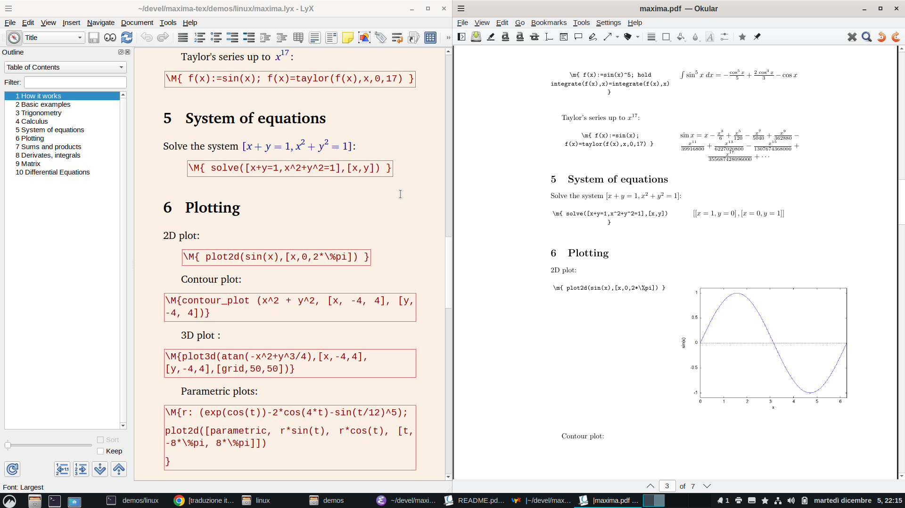
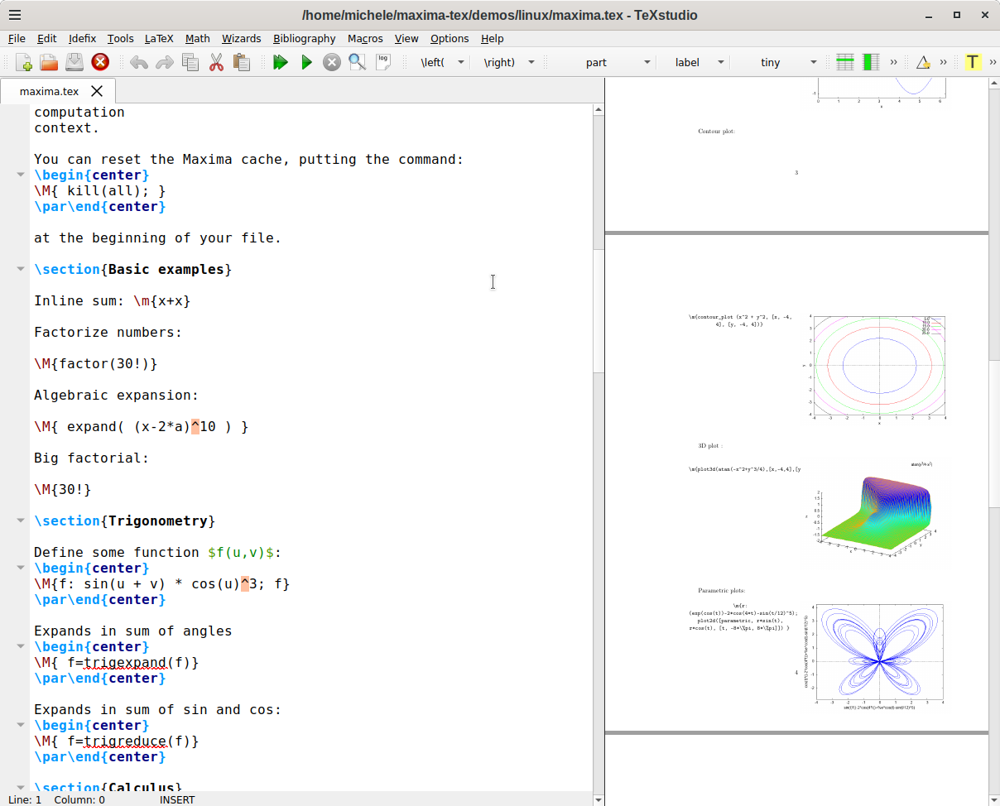
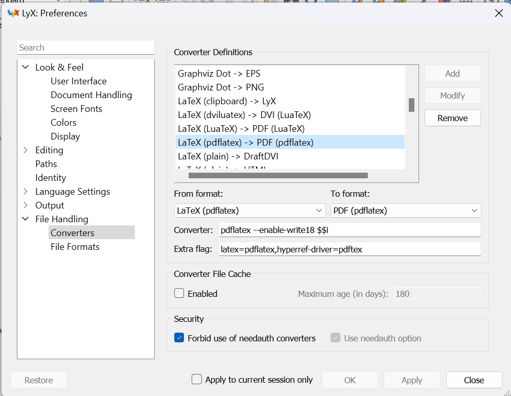

MAXIMA-TEX v1.0
===========================
*Maxima and LaTeX integration*





License
------
GPL, Copyright: Michele Andreoli (2023), PhD, CNR, Italy

The scope
-------------------

This package allows to embed MAXIMA code in LaTeX, in the form [^1]):

```
	\m{expr1; expr2; expr3; ...}

```

The macro itself will be replaced by the result of Maxima's computation.

>> **Note** *If the last expresson is ended with a “;”, the result of the whole computation will be discarded.*

[^1]:) In the LyX screenshots above here, the \\M macro is also used. It is completely identical to \\m, but produces a result in two columns: on the first the Maxima code; in the second the TeX output.


Examples
-----------

1. 2D plot

```
	\m{ plot2d(sin(x),[x,0,2*\%pi]) }
```
will produce a 2D plot, using *gnuplot* as backend.


1. Parametric plots:

```

	\m{
	r: (exp(cos(t))-2*cos(4*t)-sin(t/12)^5); 
	plot2d([parametric, r*sin(t), r*cos(t), [t, -8*\%pi, 8*\%pi]])
	}
```

1. Generate a random matrix B 10\times10

```
	\m{
	kill(g,A);
	g: lambda ([i, j], 1+random (10));
	B:genmatrix(g,10,10); 
	B
	}
```


Caching
--------

The \\m macro saves its computation context, globally.

You can reset the Maxima cache, putting the command:

```
	\m{ kill(all); }
```
at the beginning of your file.


Windows Installing
-----------

This software is installed in the dir  c:\\maxima-tex

1. Install the required Windows apps: *python* and *MAXIMA*.  Usually, *MAXIMA* is installed
   in the directory c:\\maxima-VERSION, for example c:\\maxima-5.47.0
1. Unpack the ZIP package in the *mandatory* directory  c:\\maxima-tex
1. Enter in the directory and run the installer:

   ```
	cd  c:\\maxima-tex
	python .\setup.win
   ```

Linux Installing
-----------

This software is installed in the dir /home/USERNAME/maxima-tex, where USERNAME is the user's Linux account name.

1. Install the required pachage: *python* and *MAXIMA*. 
1. Unpack the ZIP package in the directory  /home/USERNAME/maxima-tex,
   where USERNAME is the user's Linux account name.


Latex setup
------------


For the trick to work, you need to add the following line in your Latex preamble:

a. In Windows:


   ```
	\input{c://maxima-tex/maxima.tex}
	```

a. In Linux:

   ```
	\input{/home/USERNAME/maxima-tex/maxima.tex}
	```

Lyx and TeXStudio
----------------

This software is tested with Lyx and TexStudio, but should work with any other TeX typesetting system.

Normally, these software use the **pdflatex** command to produce the PDF. For the macro to work, you need to add a special switch, that enable the external execution program's flag:

1. In Windows: 
   ```
   --enable-write18
   ```
1. In Linux the 
   ```
   -shell-escape
   ```

Test with
-------------

1. In Ubuntu 23/10: TeXLive 2023.20230613-3, Maxima 5.45.1, Lyx 2.3.7-1, texstudio  4.3.1+ds-2
1. In Windows 11: basic-MikTeX 23.10, Maxima 5.47, Lyx 2.3.7. TexStudio 4.7


Screenshots
--------------






